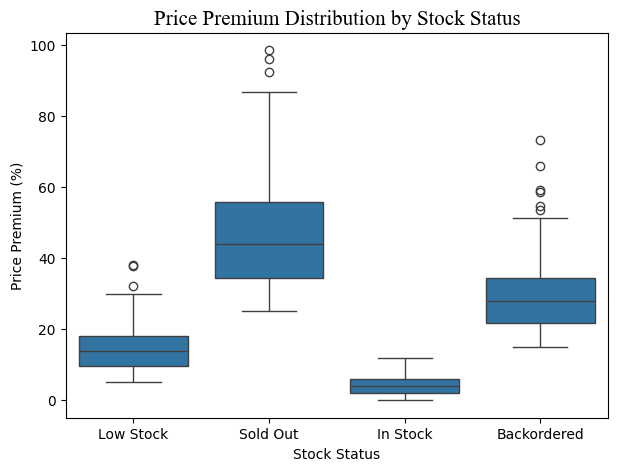
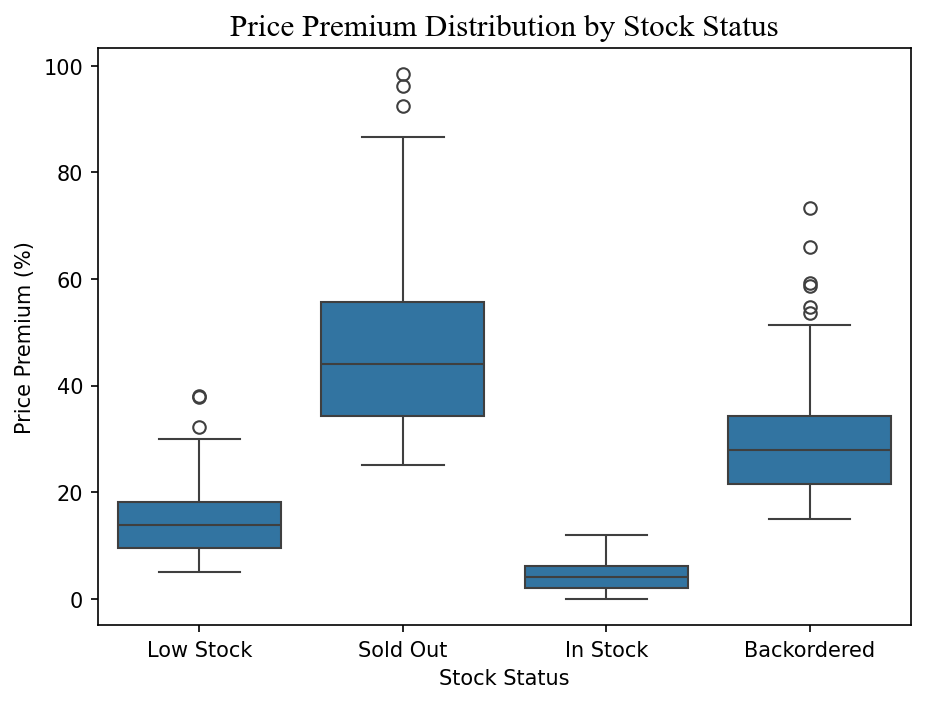
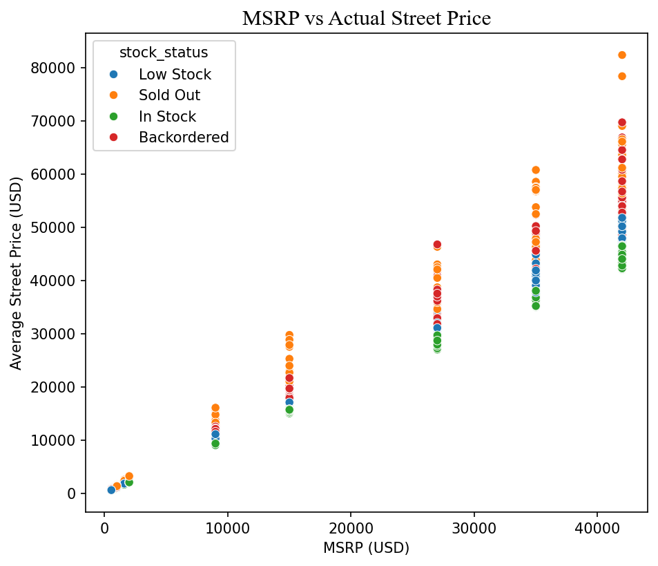
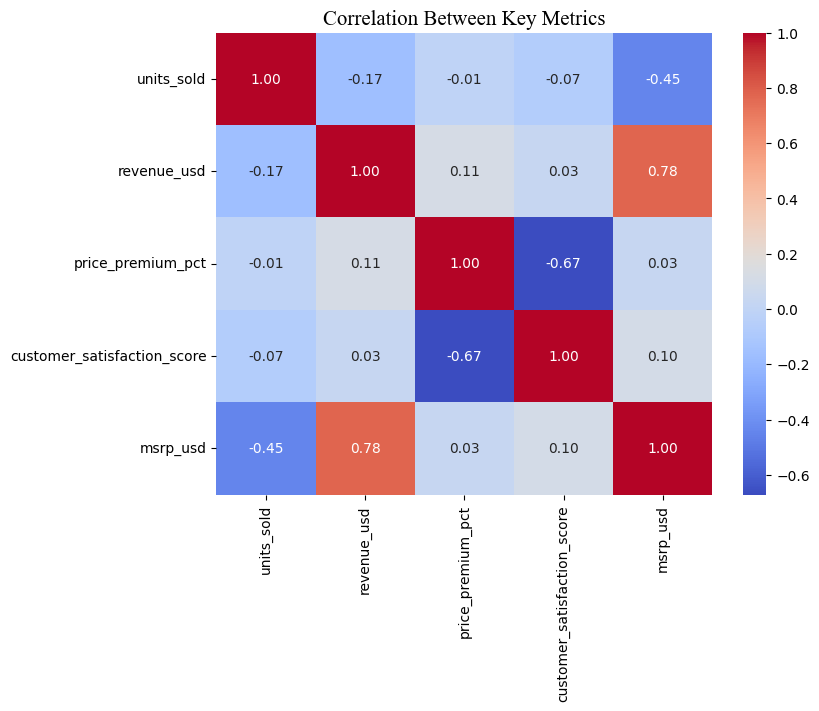

# 📈 NVIDIA GPU Sales Analysis (2024–2026)

## 📌 Overview

This project performs **Exploratory Data Analysis (EDA)** on a **NVIDIA GPU sales dataset** covering **2024–2026 (through mid-2026)**. The analysis is performed using **Python** to explore GPU sales performance, pricing trends, revenue growth, and customer behavior while uncovering meaningful business insights through data visualization.

---

## 🎯 Objectives

- Analyze sales and revenue by region and sales channel.
- Identify high-value customer segments.
- Analyze yearly and monthly sales trends.
- Visualize important business metrics.
- Generate actionable business insights from the data.

---

## 🛠️ Tools & Libraries

- Python
- Pandas
- NumPy
- Matplotlib
- Seaborn
- Jupyter Notebook

---

## 📁 Project Structure

```text
NVIDIA-GPU-Sales-Analysis/
│
├── images/
│   ├── gpu_analysis.png
│   ├── price_premium.png
│   ├── msrp_vs_price.png
│   └── correlation_matrix.png
│
├── nvidia_sales_analysis.ipynb
├── nvidia_sales_2026.csv
└── README.md
```

---

## 📊 Dataset

The dataset contains **NVIDIA GPU sales data from 2024 to 2026 (through mid-2026)** collected across different regions, sales channels, and customer segments.

### Features

- GPU Model
- GPU Family
- Launch Year
- Region
- Sales Channel
- Customer Segment
- MSRP Price
- Stock Status
- Units Sold
- Revenue (USD)
- Customer Satisfaction Score

---

# 🔍 Exploratory Data Analysis

## 🎮 GPU Analysis

Revenue and sales comparison across different GPU models and GPU families.

<p align="center">
  
</p>

---

## 💰 Price Premium Analysis

Distribution of price premiums across different stock statuses.

<p align="center">
  
</p>

---

## 💵 MSRP vs Actual Street Price

Relationship between MSRP and actual street price across different stock statuses.

<p align="center">
  
</p>

---

## 📈 Correlation Analysis

Correlation between key business metrics including:

- Units Sold
- Revenue
- Price Premium
- Customer Satisfaction Score
- MSRP

<p align="center">
  
</p>

---

# 💡 Key Insights

- **B200** generates the highest revenue despite lower unit sales, highlighting NVIDIA's focus on premium data-center GPUs.
- **Sold Out** products experience the highest price premiums, while higher premiums are associated with lower customer satisfaction.
- Premium GPUs show larger differences between MSRP and street price, indicating enterprise customers are more willing to pay above MSRP.
- **Retail/Etail** is the highest revenue-generating sales channel.
- **Gaming** is the largest customer segment by sales.
- Revenue generated during the **first half of 2026** has already reached a significant share of the **entire 2025 revenue**, indicating strong market demand.

---

# 📌 Conclusion

This project demonstrates how exploratory data analysis can uncover meaningful business insights from sales data. By analyzing pricing behavior, customer trends, revenue growth, and product performance, the project highlights key factors influencing NVIDIA GPU sales and provides valuable insights for business decision-making.


---

### ⭐ If you found this project interesting, feel free to explore the notebook and leave a ⭐ on the repository!
